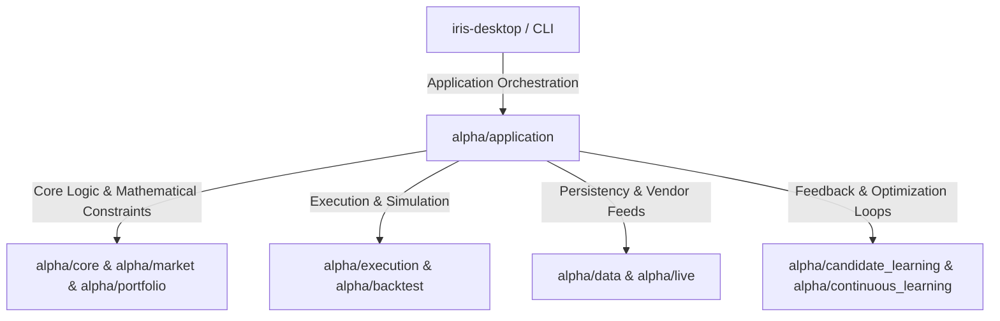

# Project Alpha High-Level Architecture

Project Alpha is a quantitative research platform designed for the Indian equity market. Below is the high-level architecture mapping, documenting subsystems, decision pipelines, backtesting frameworks, governance policy rules, and system bottlenecks.

---

## 📦 1. Major Packages & Subsystems

Project Alpha's codebase is structured around **Clean Architecture** patterns, separating core domain mathematics from infrastructure, data access, and UI.



### Subsystems Breakdown:
* **[alpha/market](file:///Users/pnw/Projects/ProjectAlpha/alpha/market)**: Domain entities like [Bar](file:///Users/pnw/Projects/ProjectAlpha/alpha/market/bar.py) (immutable OHLCV representation with strict post-init validation invariants), series managers, calendar resolvers, and indicator frameworks.
* **[alpha/portfolio](file:///Users/pnw/Projects/ProjectAlpha/alpha/portfolio)**: Holdings bookkeeping ([inventory.py](file:///Users/pnw/Projects/ProjectAlpha/alpha/portfolio/inventory.py)), constraint validators, trade accounting, and mathematical model optimizers.
* **[alpha/execution](file:///Users/pnw/Projects/ProjectAlpha/alpha/execution)**: Order routing simulations, transaction costs, and fill execution simulators.
* **[alpha/backtest](file:///Users/pnw/Projects/ProjectAlpha/alpha/backtest)**: Chronological historical replayer and accounting reconciliation system.
* **[alpha/application](file:///Users/pnw/Projects/ProjectAlpha/alpha/application)**: High-level orchestrators (`runtime.py` and `intelligence.py`) and CLI controller endpoints.
* **[alpha/data](file:///Users/pnw/Projects/ProjectAlpha/alpha/data)**: Storage repositories (DuckDB database wrapper, schemas) and downloader providers (NSE bhavcopies).
* **[alpha/optimization](file:///Users/pnw/Projects/ProjectAlpha/alpha/optimization)**: Numerical solvers implementing Equal Weight, Risk Parity, Minimum Variance, and Black-Litterman models.
* **Intelligence Engines (`alpha/*_intelligence/`)**: Domain-specific analytics pipelines (market bias, recommendation candidate ranking, portfolio sizing).
* **[alpha/provenance.py](file:///Users/pnw/Projects/ProjectAlpha/alpha/provenance.py)**: Audit lineages, version tracking, and drift evaluation to ensure research reproducibility.
* **Learning Loops (`alpha/*_learning/`)**: Outcome collectors and validation engines comparing recommendation intent with actual execution results.
* **[iris-desktop](file:///Users/pnw/Projects/ProjectAlpha/iris-desktop)**: Tauri 2 + React desktop shell interfacing with Project Alpha backend models.
* **[tradingview](file:///Users/pnw/Projects/ProjectAlpha/tradingview)**: Code generation and export utilities for Pine Script strategies.

---

## 🔄 2. Data Flow

```mermaid
sequenceDiagram
    autonumber
    Data Source->>alpha/data: NSE Bhavcopy CSV downloaded
    alpha/data->>DuckDB: parsed & stored in daily_prices table
    alpha/application/runtime: loads date-based prices dataframe
    alpha/application/runtime->>alpha/application/intelligence_inputs: maps dataframe to IntelligenceInputSet
    alpha/application/intelligence_inputs->>Intelligence Engines: distributes typed domain value objects
    Intelligence Engines->>alpha/application/intelligence: compiles into IntelligenceRun
    alpha/application/intelligence->>CLI / Tauri UI: displays allocations & exports reports
```

1. **Ingestion**: Raw National Stock Exchange of India (NSE) Bhavcopy CSV files are downloaded via [downloader](file:///Users/pnw/Projects/ProjectAlpha/alpha/data/downloader) services and ingested into the embedded [Database](file:///Users/pnw/Projects/ProjectAlpha/alpha/data/repositories/database.py) (DuckDB table `daily_prices`).
2. **Parsing**: The [ProjectAlphaRuntime](file:///Users/pnw/Projects/ProjectAlpha/alpha/application/runtime.py) reads chronological series frames and forwards them to [IntelligenceInputBuilder](file:///Users/pnw/Projects/ProjectAlpha/alpha/application/intelligence_inputs.py).
3. **Abstraction**: Raw pandas dataframes are transformed into [IntelligenceInputSet](file:///Users/pnw/Projects/ProjectAlpha/alpha/application/intelligence_inputs.py#L75-L94), creating a strongly-typed boundary.
4. **Execution**: Business logic computes recommendations and optimal portfolios, returning a machine-readable [IntelligenceRun](file:///Users/pnw/Projects/ProjectAlpha/alpha/application/intelligence.py#L54-L63) payload.

---

## 🧠 3. Decision Pipeline

The decision engine runs inside [IntelligenceApplicationService.run()](file:///Users/pnw/Projects/ProjectAlpha/alpha/application/intelligence.py#L183-L200):

1. **Market Intelligence Assessment**: The `MarketIntelligenceCompositeEngine` evaluates breadth, sector rotation, correlation risk, and liquidity to compute a market bias (e.g. `BUY`, `AVOID`, or `NEUTRAL`).
2. **Recommendation Candidate Filtering**: The `RecommendationEngine` evaluates active candidate setups, scores technical/volatility metrics, and filters out unfit candidates.
3. **Portfolio Construction & Capital Sizing**: The `PortfolioConstructionEngine` applies allocation checks and triggers numerical portfolio optimization solvers (e.g. `maximum_sharpe` or `risk_parity`).
4. **Governance Checks**: The pipeline runs institutional rules, verifying limits on cash remaining, single-name concentration, and sector exposures.
5. **Narrative Generation**: The `IntelligenceExplainabilityEngine` generates natural-language logs detailing why allocations were restricted, approved, or skipped.

---

## ⏱️ 4. Replay Pipeline

Backtesting is managed by [BacktestApplicationService](file:///Users/pnw/Projects/ProjectAlpha/alpha/application/backtest.py):

* **Chronological Simulation Loop**: The replayer steps forward day-by-day.
* **Order Generation**: Generates daily technical indicators, triggers trading signals, and generates a list of [BacktestOrder](file:///Users/pnw/Projects/ProjectAlpha/alpha/backtest/models.py) objects.
* **Execution & Slippage Simulation**: The [BrokerSimulator](file:///Users/pnw/Projects/ProjectAlpha/alpha/backtest/broker.py) matches orders at target prices, factoring in transaction slippage and costs.
* **Ledger State**: The [ExecutionLedger](file:///Users/pnw/Projects/ProjectAlpha/alpha/backtest/ledger.py) updates positions, processes cash reconciliations, and records transaction logs.
* **Attribution**: Outputs [BacktestSummary](file:///Users/pnw/Projects/ProjectAlpha/alpha/application/backtest.py#L53-L67) mapping key statistics (Sharpe, Calmar, Win Rate, Expectancy).

---

## 🎯 5. Candidate Generation

Located in [candidate_generation_research](file:///Users/pnw/Projects/ProjectAlpha/alpha/candidate_generation_research):

* **Funnel Filtering**: The [CandidateFunnel](file:///Users/pnw/Projects/ProjectAlpha/alpha/candidate_generation_research/candidate_funnel.py) evaluates symbols on volume confirmation, relative strength, and momentum floors.
* **Onset Identification**: Captures the start of technical setups (e.g., breakouts, gap-ups).
* **Variant Generation**: The [VariantGenerator](file:///Users/pnw/Projects/ProjectAlpha/alpha/candidate_generation_research/variant_generator.py) checks variation parameters (e.g., custom stop ATR values, target risk budgets) to optimize entry parameters.

---

## 🛡️ 6. Institutional Approval & Policy

Located in [portfolio_policy](file:///Users/pnw/Projects/ProjectAlpha/alpha/portfolio_policy):

* **Policy Rules**: Plugs custom governance checks into the [PolicyRulePipeline](file:///Users/pnw/Projects/ProjectAlpha/alpha/portfolio_policy/pipeline.py).
* **Scopes**: Evaluates parameters across different levels (`PORTFOLIO`, `SECTOR`, or `SECURITY`).
* **Evaluation Decisions**: Rule evaluations result in a decision (e.g., `APPROVE`, `REVIEW`, `RESTRICT` - to limit deployment weight, or `REJECT` - to block execution).
* **Blocking Actions**: The [PortfolioPolicyEngine](file:///Users/pnw/Projects/ProjectAlpha/alpha/portfolio_policy/engine.py) checks if any evaluations failed with blocking severity, preventing the asset from entering the allocation solver.

---

## 🔄 7. Learning System

Located in [candidate_learning](file:///Users/pnw/Projects/ProjectAlpha/alpha/candidate_learning) and [continuous_learning](file:///Users/pnw/Projects/ProjectAlpha/alpha/continuous_learning):

* **Outcome Collection**: Tracks trade outcomes over forward periods (e.g., 20 days or 60 days) to flag success/failure label parameters.
* **Entry Timing Validation**: The `EntryTimingValidationEngine` compares execution fills against optimal trade windows.
* **Policy Review (Profitable Rejections)**: The `ApprovalDiagnosticsEngine` audits the performance of rejected candidates to identify excessive policy drag.
* **Bayesian parameter updates**: Adjusts sector/regime indicator weights based on realized feature importance.

---

## 🖥️ 8. CLI Commands

Configured using Typer in [alpha/cli.py](file:///Users/pnw/Projects/ProjectAlpha/alpha/cli.py):

* `version`: Prints platform build versions.
* `doctor`: Run quality checks, release status.
* `run`: Daily live market analysis and portfolio optimization loop.
* `simulate`: Run backtesting sweeps.
* `trades`: Replays/inspects ledger logs.
* `playbook`: Renders rank lists of setups/indicators.
* `provenance`: Runs lineage verification and version drift audits.

---

## 🔌 9. Key Extension Points

1. **Portfolio Optimizers**: Add a class implementing [Optimizer](file:///Users/pnw/Projects/ProjectAlpha/alpha/portfolio/optimizer.py#L87-L96) and register it inside [default_optimizer_registry()](file:///Users/pnw/Projects/ProjectAlpha/alpha/portfolio/optimizer_registry.py#L66-L76).
2. **Policy Constraints**: Subclass [PortfolioPolicyRule](file:///Users/pnw/Projects/ProjectAlpha/alpha/portfolio_policy/rule.py#L16-L23) and include the check in the evaluation engine pipeline.
3. **Data Ingestion**: Add provider subclasses to [alpha/data/providers](file:///Users/pnw/Projects/ProjectAlpha/alpha/data/providers) to ingest alternative feeds.

---

## ⚠️ 10. Three Biggest Architectural Bottlenecks

Based strictly on the current implementation details:

1. **Synchronous Ingestion Loop during Replays**:
   In [BacktestApplicationService._load_market_data](file:///Users/pnw/Projects/ProjectAlpha/alpha/application/backtest.py#L301-L333), bhavcopy files are resolved and ingested sequentially day-by-day in a blocking single-threaded `while` loop. Over long historical ranges (e.g., 5 years), this makes data loading a significant I/O bottleneck.
2. **DuckDB Database Connection Locking**:
   In [Database](file:///Users/pnw/Projects/ProjectAlpha/alpha/data/repositories/database.py#L15-L27), DuckDB is opened in write-locking mode. This design prevents concurrent client tasks (e.g., parallel parameter runs, concurrent CLI audits, and local background sweeps) from accessing database tables simultaneously.
3. **Monolithic CLI Controller**:
   [alpha/cli.py](file:///Users/pnw/Projects/ProjectAlpha/alpha/cli.py) is a ~11,000 line monolith. It mixes CLI subcommand routing with terminal table rendering, report generation, validation logic, and presentation helper wrappers, which complicates maintenance.
